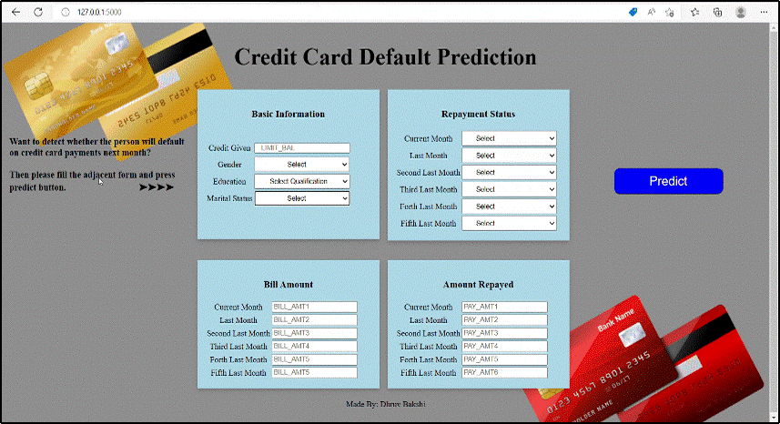

# Machine Learning Project

Flask application demo
 

### Software and Account Requirement

1. [Github Account](https://github.com/) 
2. [VS Code IDE](https://code.visualstudio.com/Download)
3. [Gitcli](https://git-scm.com/downloads)
4. [Kaggle Account](https://www.kaggle.com)
